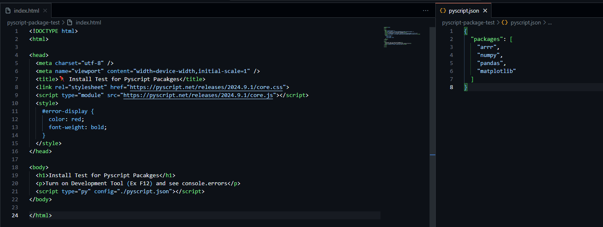
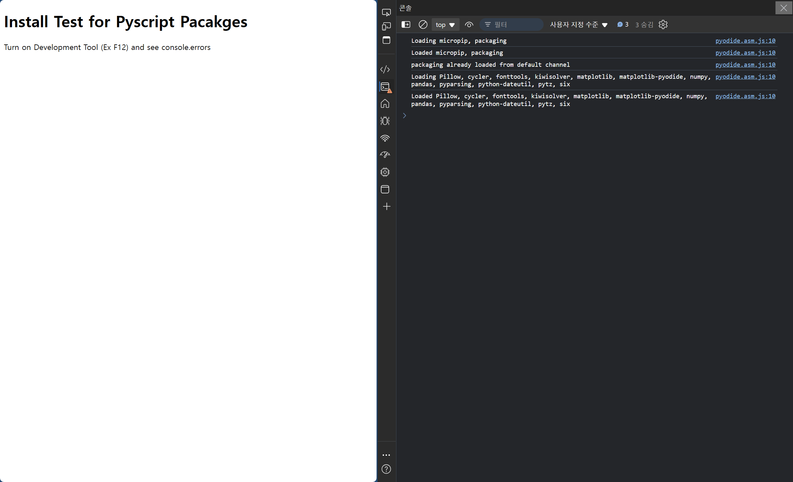
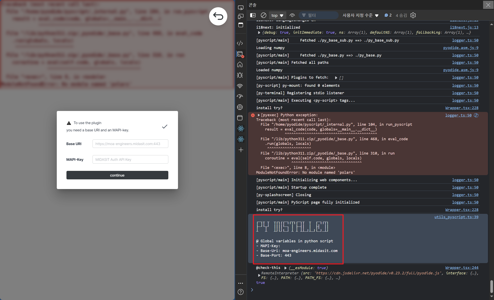
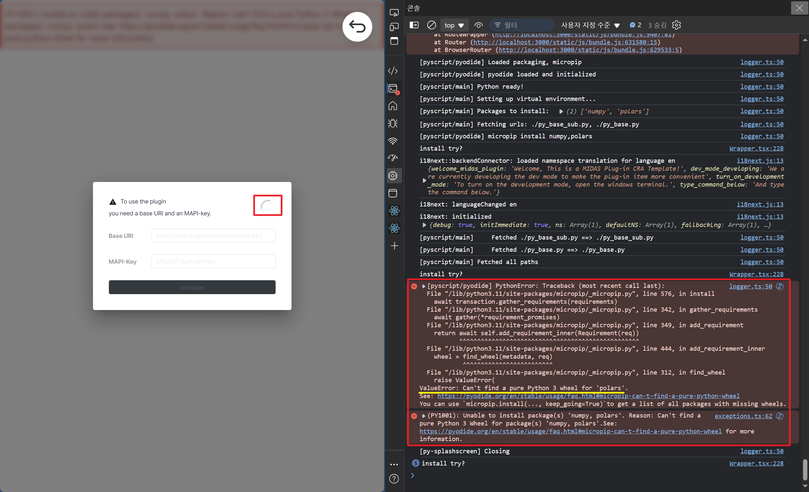
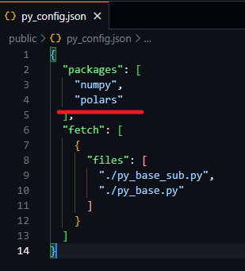

## **PyScript 패키지 호환성 검증 테스트 페이지**

이 페이지는 **PyScript** 환경에서 사용할 수 있는 패키지를 검증하기 위해 제작되었습니다. PyScript는 브라우저 기반으로 실행되기 때문에, 일반적인 운영체제(OS) 환경에서의 Python과 달리 사용할 수 있는 패키지에 제한이 있습니다. 이 테스트 페이지를 통해 특정 패키지가 PyScript에서 정상적으로 동작하는지 검증할 수 있습니다.

### PyScript 패키지 제약 사항

PyScript에서 패키지를 설치할 때, [Pyodide 문서](https://pyodide.org/en/stable/usage/faq.html#why-can-t-micropip-find-a-pure-python-wheel-for-a-package)에 명시된 두 가지 제약 사항을 확인해야 합니다:

- **패키지가 순수 파이썬이지만 휠 파일이 업로드되지 않은 경우**  
  패키지가 순수 파이썬으로 작성되었으나, 유지보수자가 PyPI에 휠 파일을 업로드하지 않은 경우입니다. 이 경우, 패키지의 이슈 트래커에 문제를 보고하거나, 직접 휠을 빌드하여 임시로 업로드한 후 `micropip`을 통해 설치할 수 있습니다.
- **패키지가 바이너리 확장을 포함하는 경우**  
  패키지에 C, Fortran, Rust 등의 바이너리 확장이 포함된 경우, 해당 패키지는 Pyodide 환경에서 별도의 패키지화 과정이 필요합니다. 이와 관련된 이슈가 이미 존재하는지 확인한 후, 없을 경우 새 이슈를 등록해야 합니다.

PyScript가 초기화되는 동안 연동된 Pyodide를 다운로드한 후, 지정된 패키지를 설치할 때 이러한 제약 조건을 확인합니다. 만약 패키지에 순수 파이썬 휠이 없다면 설치 과정에서 오류가 발생합니다.

### 테스트 페이지 사용 방법

다음 절차를 통해 특정 패키지가 PyScript에서 정상적으로 동작하는지 테스트할 수 있습니다.

1. **`index.html` 실행**  
   테스트 페이지를 로드합니다.

   

2. **`pyscript.json` 파일 수정**  
   `pyscript.json` 파일에 테스트하려는 패키지를 추가하고 저장합니다.

   

3. **`index.html` 새로고침 및 개발자 도구 확인**  
   페이지를 새로고침한 후, 개발자 도구(F12)를 열고 **Console**에서 설치 과정 중 오류가 발생했는지 확인합니다.

   

4. **패키지 호환성 확인**  
   오류 메시지가 표시되지 않는다면, 해당 패키지는 PyScript에서 사용할 수 있는 패키지입니다.

 

## VerifyDialog 무한 로딩 문제 해결

플러그인의 **VerifyDialog**가 무한 로딩 상태에 빠지는 경우, 이는 **PyScript**가 정상적으로 로드되지 않아 발생한 문제일 수 있습니다. **VerifyDialog**가 정상적으로 로드되기 위해서는 웹페이지가 완료된 상태로 로드되고, 자바스크립트 전역 변수인 `pyscript`와 `pyscript.interpreter`가 반드시 존재해야 합니다.

만약 이 변수들이 존재하지 않는 경우, 100ms 간격으로 변수가 생성되었는지 확인하는 과정이 반복됩니다.

### 해결 방법

현재 개발 중인 웹페이지에서 **개발자 도구(F12)**를 열고, **Console** 창을 통해 PyScript 로딩 상태를 확인하세요.

- **PyScript가 정상적으로 로드된 상태**

  

- **패키지 로딩 오류로 인한 VerifyDialog 무한 로딩 상태**

  
  
